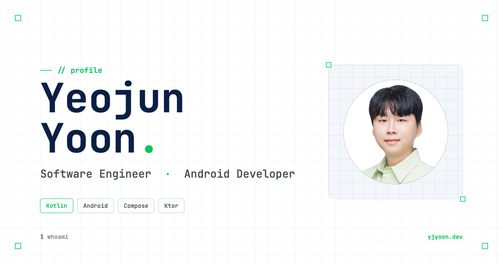

# yjyoon.dev

[](https://app.netlify.com/projects/yjyoon/deploys)

> An Android Developer who loves to build and share.

Personal portfolio site of **Yeojun Yoon**, an Android Developer at NAVER.
Live at **[yjyoon.dev](https://yjyoon.dev)**.



<br/>

## ✨ About

A static, single-page portfolio with a developer-y aesthetic — JetBrains Mono accents, NanumSquare Neo body type, a navy + green palette, and a quiet grid motif throughout. No build step, no framework — just hand-written HTML, CSS, and a sprinkle of vanilla JavaScript.

The previous version of this site was a Kotlin/Wasm + Compose Multiplatform app. This rewrite trades the WASM toolchain for a single static HTML file that loads instantly and is trivial to host anywhere.

<br/>

## 📐 Sections

- **Hero** — Greeting, name, intro, primary links
- **About** — Bio, skill stack
- **Career** — NAVER, Kakao Brain, Neurosky (with team-level stints)
- **Talks** — Conference & meetup speaker decks
- **Clubs** — SW Maestro, YAPP, Nexters, Depromeet
- **Side Projects** — 20 projects in a dense grid
- **Highlights** — Awards, mentoring, certs, and more (tabbed)
- **Footer** — Contacts

<br/>

## 🌗 Features

- **Light / Dark theme toggle** — preference is saved in `localStorage`
- **KOR / ENG language toggle** — content swaps via `data-lang` attributes
- **Responsive layout** — desktop, tablet, mobile
- **Static & framework-free** — opens with a simple file server, no build pipeline

<br/>

## 🚀 Local preview

No build step. Just open `index.html` in a browser, or serve the folder with any static server:

```bash
# Python
python3 -m http.server 8000

# Node
npx serve .
```

<br/>

## 🗂️ Structure

```
.
├── index.html          # Single-page portfolio (styles + scripts inlined)
├── assets/
│   ├── favicon.svg     # Material 3 switch motif
│   ├── og-image.png    # 1200×630 social preview
│   ├── profile.jpg
│   ├── ic_*.png        # Skill & contact icons
│   ├── img_*.png       # Company logos
│   └── side/           # Side-project logos
├── fonts/
│   └── NanumSquareNeo-Variable.ttf
└── netlify.toml
```

<br/>

## 🎨 Design

- **Palette** — navy `#0a1f44`, green `#03c75a`, neutral grays
- **Type** — NanumSquare Neo (body), JetBrains Mono (code & accent)

<br/>

## 📜 License

```
Designed and developed by 2026 Yeojun Yoon with Claude Design

Licensed under the Apache License, Version 2.0 (the "License");
you may not use this file except in compliance with the License.
You may obtain a copy of the License at

   http://www.apache.org/licenses/LICENSE-2.0
```
